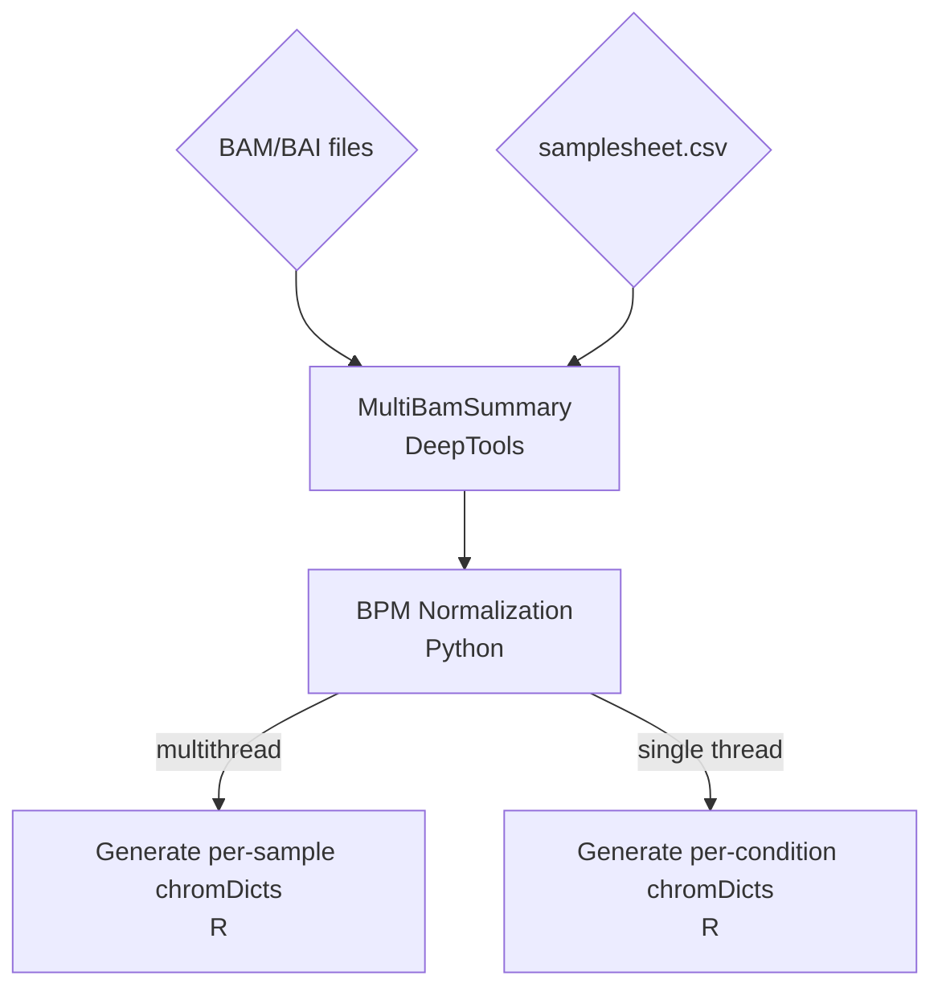

# chromDict Automated Workflow

ChromDicts are an extremely useful datatype for whole genome analyses, but generating them manually can be slow and irritating. This workflow will take bam files as an input, and return R-ready sample and condition specific chromDicts.

## Workflow



## Basic Use

The workflow takes the following parameters:

``` bash
nextflow run main.nf \
    input = samplesheet.csv \ # csv of sample data
    outputPath = "results" \ # name of output folder, defaults to 'results'
    binSize = 20 \ # size of genomic bins for value quantification, should be very small!
    mapQuality = 30 \ # minimum acceptable mapping quality for
    blacklist = null # optional but recommended input bed of regions to blacklist
```

## Sample Sheet 

The samplesheet.csv contains three columns: sample, path, and condition. For each sample, you supply a sample name, a bam file path (**MUST** also contain a matching bam.bai), and a treatment conditions. E.g.:

| sample | path | condition |
| --- | --- | --- |
| trt1 | /path/to/trt1.bam | treatment |
| trt2 | /path/to/trt2.bam | treatment |
| ctl1 | /path/to/ctl1.bam | control |
| ctl2 | /path/to/ctl2.bam | control |


## IGC Use

For IGC users, this pipeline has been tested on Cask, and will run with the following parameters:

``` bash

nextflow run /vast/igc/analyses/kat/nextflow/MakeChromDicts/main.nf \
    --input /path/to/samplesheet.csv \ # sample sheet as .csv, see above
    --binSize 20 \ # size of genomic bins -- should be small
    --mapQuality 30 \ # minimum MQ for bam reads to be counted
    -c /vast/igc/analyses/kat/nextflow/local_configs/config_kat_general \ # links to existing singularity images and mounts vast & gpfs
    --blacklist /vast/igc/analyses/kat/Kat_Files/mm10_blacklist_telocentro_contig.bed \ # optional blacklist. Ideally includes all contigs in addition to known blacklist sites. This is the best blacklist for mm10.
    -profile singularity #-resume

```

## Limitations

* The primary limitation of this workflow is that it anticipates the reference genome to have either a purely numeric chromosome naming convention (e.g.: 1, 2, ..., X, Y) OR for the chromosomes to be some case-insenstitive variation of "chr" (e.g.: "chr1", "chr2", ... "chrX", "chrY"). Either naming convention must be used **in the bam file**, or the workflow will fail or potentially produce incomplete files.

* Any chromosome that is non-numeric, X, or Y will be automatically excluded from the output chromDicts. To include mitochondria, contigs, unconventional sex chromosomes, transgenes, etc, you can use the multibamsummary output to generate chromDicts manually with the chromDicts R package.


## Outputs

The workflow will output the following:

* results/bed
	* contains the raw and BPM-normalized output from multibamsummary
* results/perSample_chromDicts
	* RDS files containing one chromDict for each sample
* results/perCondition_chromDicts
	* RDS files containing one chromDict for the average of each condition


## Downstream Analysis

ChromDicts are optimized to make whole-genome epigenomic analyses memory efficient in R. The chromDicts R package contains functions that allow you to make many powerful visualizations in ggplot, including metagenes and peak tracks. For more info, see the [vignette](https://github.com/katlande/chromDicts/blob/main/vignette.md).

